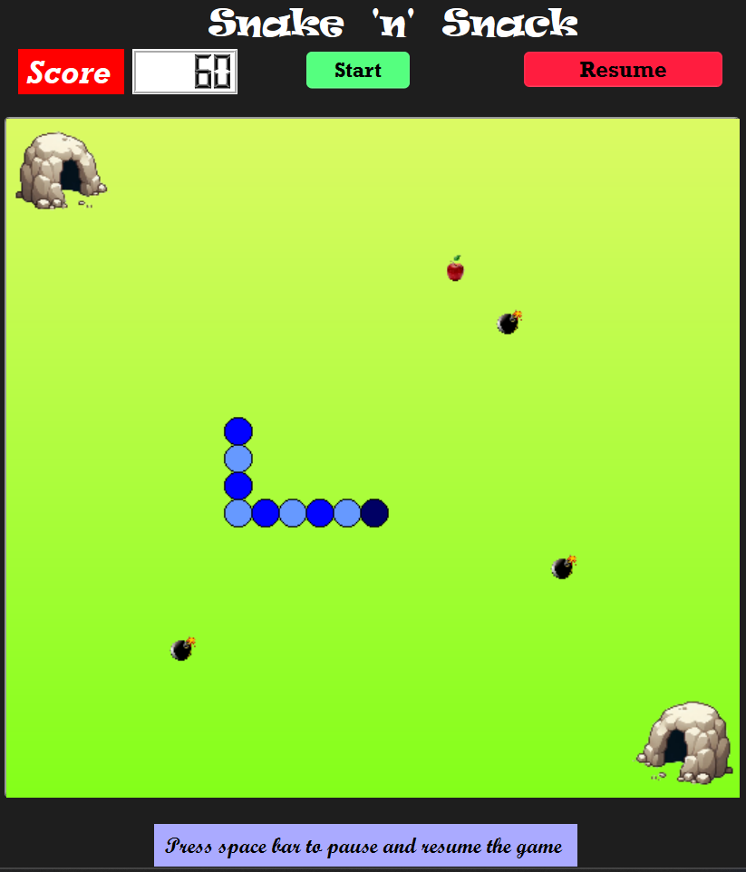
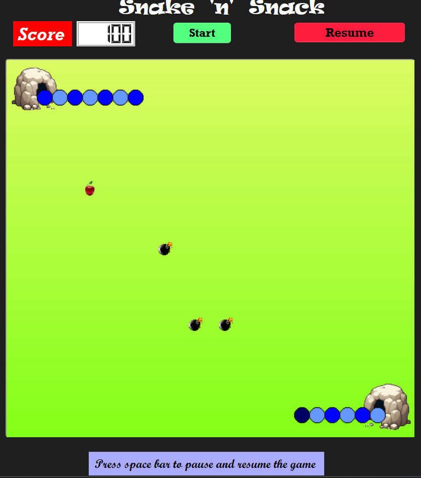
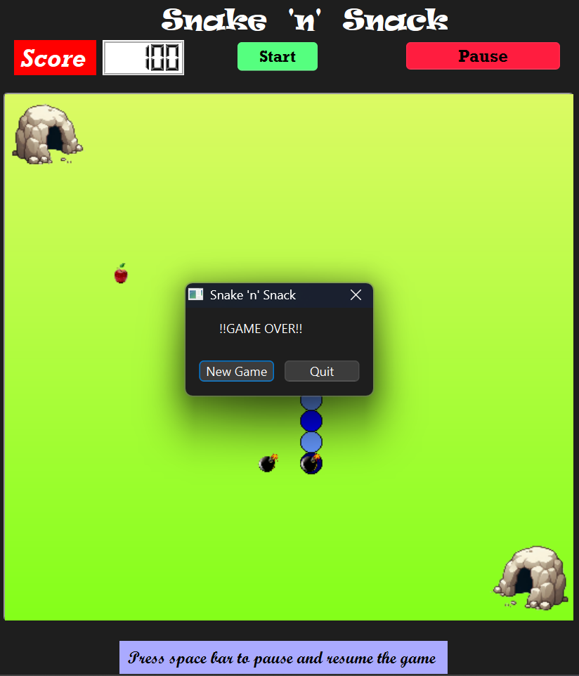

# 🐍 Snake Game (Built with Qt)

A modern, fun twist on the classic Snake game — developed using **Qt Framework**.  
This game features teleportation caves, increasing difficulty with speed and size mechanics, and a clean user interface.

## 🎮 Features

- ✅ **Classic Snake Mechanics**: Navigate the snake using arrow keys.
- 🍏 **Food Consumption**: Eating food increases the **snake’s length** and **speed**.
- 🕳️ **Teleportation Caves**: Entering one cave instantly moves the snake to another location on the board.
- ⏸️ **Pause/Resume Game**: Press the designated key to pause or resume gameplay.
- 💀 **Game Over Detection**: Collision with self or boundaries ends the game.
- 🎨 **Smooth UI**: Built using Qt's powerful UI framework for cross-platform performance.

## 🖼️ Screenshots

### ▶️ Gameplay



### 🕳️ Teleportation Cave



### ⏸️ Game Over 



## 🛠️ Built With

- **Qt Framework** 
- **C++**
- Object-Oriented Design
- KeyPressEvent handling for snake control

## 🚀 How to Run

1. Clone this repository:
   ```bash
   git clone https://github.com/Ramji-Bhagat/snake-qt.git
   cd snake-qt
   
2. Open the .pro file in Qt Creator.

3. Build and run the project.
